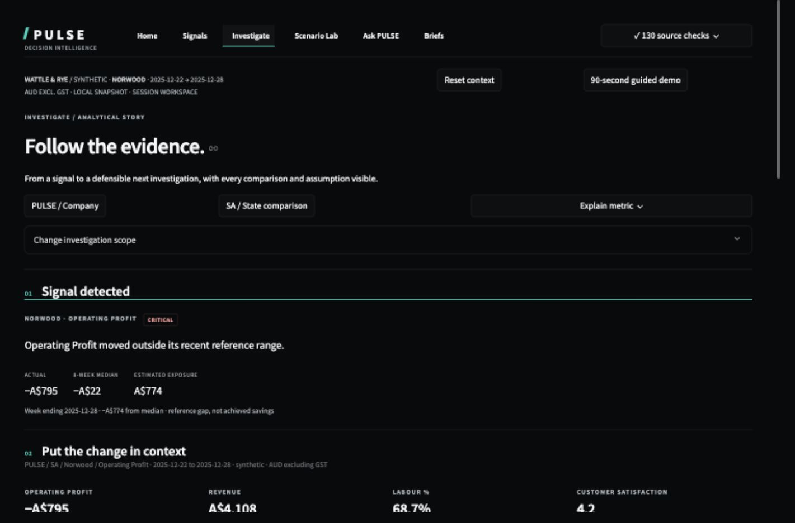
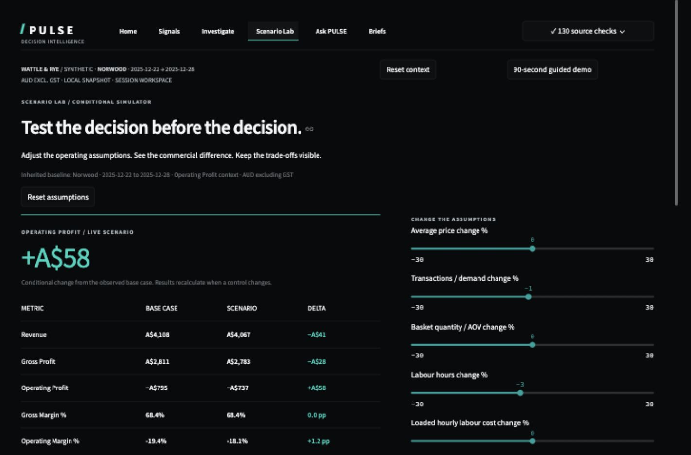
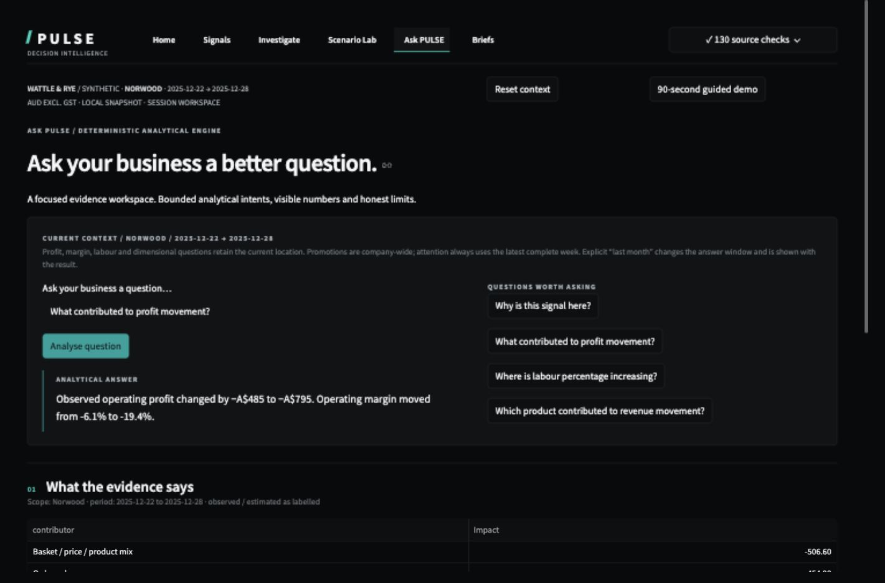
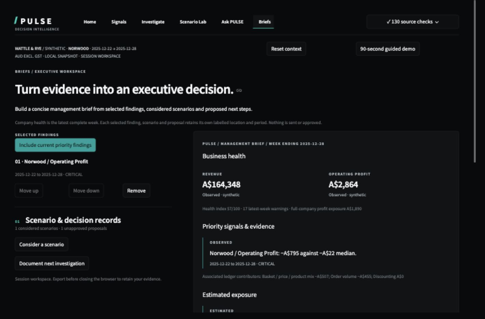

# PULSE
### Business Early-Warning & Decision Intelligence

**Click a business signal. Follow the evidence. Test a decision. Turn it into an executive brief.**

PULSE helps a manager move from “something changed” to a defensible next investigation. Its six connected workflows carry the selected location, KPI and period through warning evidence, accounting contributors, comparison, a conditional scenario and an unapproved decision record.


[](https://github.com/yashayyy27/PULSE/actions/workflows/ci.yml)

**Entirely synthetic:** Wattle & Rye, 36 fictional Australian food/pantry locations, January 2024–December 2025, **1,060,291 orders** in the full demo. No employer data, real discovery interviews, real approvals or achieved benefits. No paid service or credentials required. A hosted application has not been deployed.

## Explore one decision in 90 seconds

Open **Home → 90-second guided demo**. The full dataset identifies Norwood's weekly operating-profit signal: **−A$795 observed**, **−A$22 prior-eight-week median**, **A$774 estimated reference gap**. The company health index is **57/100**, with **17 latest-week signals** and **A$1,890** operating-profit warning exposure, counting each warned location once. These are generated results, not current business guidance.

The guide opens the exact signal, reveals why it triggered and shows the previous-week accounting bridge. It then tests **−3% labour hours with −1% demand**, saves the assumptions and builds an executive brief with an explicitly fictional, unapproved proposal. Back and Exit work throughout. Any modelled improvement is conditional; service response and feasibility remain untested. [Walkthrough](docs/DEMO.md) · [Recruiter guide](docs/RECRUITER_GUIDE.md).

## Six workflows, one context

| Destination | What it helps you decide |
|---|---|
| **Home** | What changed, what needs attention and which signal to follow. The Pulse shows twelve complete weeks of governed business health; clicking a latest-window marker selects its exact warning. |
| **Signals** | Which warning deserves review. Filter severity/domain/location/KPI/session status; acknowledge, investigate, compare, ask or add to brief. |
| **Investigate** | How unusual the signal is, which ledger movements reconcile the change, what the exposure represents and which path to investigate. Progressive evidence, four comparisons, ten business-driver dimensions and registry-backed metric explanations. |
| **Scenario Lab** | What changes under nine supported operating assumptions. Live base/scenario/delta, exact reset, retained inputs and saved comparisons. |
| **Ask PULSE** | What the deterministic analytical engines can establish. Contextual questions, actual evidence, explicit scope/period, method, limits and working follow-ups. No LLM or generated SQL. |
| **Briefs** | Which evidence, scenario and proposed decision should reach an executive. Add/order/remove findings and download a real curated HTML brief or JSON evidence. |

Customer, operations and forecast lenses appear inside investigation. Data quality, the 19-KPI registry and exploratory health weights live in the secondary source-checks panel. The visual language uses obsidian, silver and restrained turquoise, without team logos, racing graphics or affiliation. [Design and state approach](docs/UI_UX_TRANSFORMATION_PLAN.md) · [RESTOPS differentiation](docs/RESTOPS_DIFFERENTIATION.md).

## Run locally

Use Python 3.12:

```bash
git clone https://github.com/yashayyy27/PULSE.git
cd PULSE
python3.12 -m venv .venv
source .venv/bin/activate
python -m pip install -r requirements.txt
python scripts/setup_demo.py
python -m streamlit run app/main.py --server.address 127.0.0.1
```

On Windows activate with `.venv\Scripts\activate`. Open [localhost](http://127.0.0.1:8501).

Full setup regenerates about 13 MB compressed source and a 198 MiB SQLite database. Generated data stays outside Git. For a quick six-store/210-day fixture use `python scripts/setup_demo.py --small`; this produces different findings. Run without `--small` to restore the full case. `PULSE_DB` accepts an absolute alternate database path. Do not rebuild during an active manager session. Forecasts continue fictional history into January 2026; they are not current business forecasts.

## Actual product screens

| Investigation | Scenario Lab |
|---|---|
|  |  |

| Ask PULSE | Executive brief |
|---|---|
|  |  |

Screenshots come from the running full demo. [Interaction audit](docs/UI_UX_INTERACTION_AUDIT.md) · [Transformation results and limits](docs/UI_UX_FINAL_REPORT.md).

## Evidence beneath the experience

- [29 BA artefacts](docs/business-analysis): simulated discovery, prioritisation, requirements, acceptance, traceability, process maps, UAT, governance, change and proposed benefits.
- [SQL star schema](sql/schema.sql), [transformations](sql/transform.sql), [dimensional contribution](sql/dimensional_contribution.sql) and [campaign economics](sql/promotion_analysis.sql).
- [Governed analytical methods](docs/ARCHITECTURE.md), [tests](tests), [quality checks](reports/data_quality.csv), [pipeline hash manifest](reports/pipeline.json), [source-preservation manifest](reports/ui_backend_baseline.json) and [full verification](reports/full_verification.json).
- [Interview case study](docs/PORTFOLIO_CASE_STUDY.md), [verified interview answers](docs/FINAL_AUDIT.md#ten-questions-an-interviewer-may-ask), [recommendations](docs/business-analysis/21-executive-recommendations.md) and [audit](docs/FINAL_AUDIT.md).

## Verify

```bash
python -m pip install -r requirements-dev.txt
python -m ruff check pulse app scripts tests
python -m ruff format --check pulse app scripts tests
python -m pytest -q
python scripts/check_docs.py
python scripts/verify_full.py
```

CI uses Python 3.12 with the dependency lock, Ruff, a small synthetic rebuild, tests and local documentation checks on push/PR. `verify_full.py` independently reconciles the existing local snapshot, every location, ten dimensions and the six destinations. It checks raw hashes and does not regenerate source. `make setup`, `make data`, `make test`, `make lint` and `make run` mirror the commands.

## Architecture and boundaries

`pulse/` retains the existing authoritative data, KPI, alert, analytical, forecast, scenario, question and reporting engines. `sql/` retains grain-safe transformations. `app/` contains a product shell, pure state transitions, snapshot-keyed cached adapters, central design tokens/components and six workflows. `docs/` and `reports/` hold the BA and executed verification evidence.

The health index uses fictional stakeholder targets, not learned risk coefficients. Warning exposure is a reference gap; related KPI estimates overlap. Accounting contributors and campaign ROI do not establish causality. The single-SKU source, voluntary feedback and incomplete customer identity limit interpretation. Forecast bands have only three calibration origins and weak held-out coverage; paid hours are not an optimal/compliant roster. Scenarios have no automatic elasticity, service response or guaranteed savings.

Selections, acknowledged status, scenarios and proposals are browser-session records until exported. The top bar persists across destinations but is not a fixed overlay while scrolling; no unverified keyboard shortcut is advertised. Native Streamlit controls and chart selection are used without parent-window JavaScript. Warning time scope is the latest complete week; the UI does not pretend to reconstruct historical warnings. Desktop/laptop is primary, with narrow layouts checked. Developer accessibility checks are not WCAG certification or real stakeholder UAT.

Production would need authentication, roles, live source contracts, durable cases/audit logs, snapshot versioning, prospective warning/forecast evaluation and real user validation. Development used AI assistance. Interview claims should reflect what you have personally reproduced and can explain.
