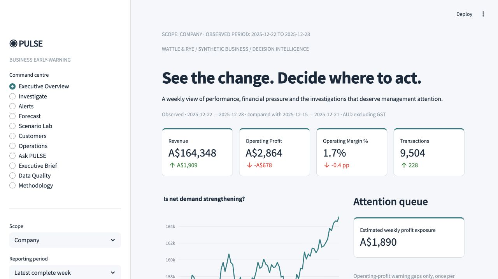

# PULSE
### Business Early-Warning & Decision Intelligence

Most dashboards tell you what happened. **PULSE identifies what changed, where to investigate, what it may be costing, and what could happen next.**

A complete Business Analyst portfolio case: ambiguous problem → simulated stakeholder discovery → prioritised requirements → governed SQL model → warning evidence → commercial scenario → proposed decision → verification and adoption plan.



**Entirely synthetic:** Wattle & Rye, 36 fictional Australian food/pantry stores across six jurisdictions, January 2024–December 2025, **1,060,291 orders** in the full demo. No employer data, real interviews, real approvals or achieved benefits. No paid service or credentials required.

[Recruiter guide](docs/RECRUITER_GUIDE.md) · [Two-minute walkthrough](docs/DEMO.md) · [Interview case study](docs/PORTFOLIO_CASE_STUDY.md) · [Verified results and ten model answers](docs/FINAL_AUDIT.md)

## One decision worth investigating

The week ending 28 December 2025 produces a **Norwood operating-profit warning**: observed profit **−A$795**, eight-week median **−A$22**, estimated weekly reference gap **A$774**. This gap is not an achieved saving. Inspect the equal-length previous-week profit bridge, which uses a different comparison from the warning median, then challenge a proposed staffing change with a demand/service sensitivity.

Company headline profit is **A$2,864** on **A$164,348** revenue. Estimated weekly operating-profit warning exposure is **A$1,890**, counting each warned store once. Related revenue, labour and stockout estimates overlap and are not added. These numbers are generated by the full dataset; the small CI fixture produces different results. [Evidence](reports/monday_brief.json) · [Recommendations](docs/business-analysis/21-executive-recommendations.md).

## Run locally

Use Python 3.12:

```bash
git clone https://github.com/yashayyy27/PULSE.git
cd PULSE
python3.12 -m venv .venv
source .venv/bin/activate
python -m pip install -r requirements.txt
python scripts/setup_demo.py
python -m streamlit run app/main.py --server.address 127.0.0.1
```

On Windows activate with `.venv\Scripts\activate`. Open [localhost](http://127.0.0.1:8501). A full rebuild generates about 13 MB of compressed source and a 198 MiB SQLite database; actual timing is in the audit. For a quick six-store, 210-day demonstration, run `python scripts/setup_demo.py --small`. It replaces the local demo with the smaller sample. Run the command without `--small` to restore the full case.

Generated datasets are excluded from Git. Setup regenerates all data and analytics; README headline figures refer to the full seed. The forecast continues fictional history into January 2026; it is not a current business forecast. To use another database snapshot, set `PULSE_DB` to its absolute path. Do not refresh while a manager session is active.

## What management can do

| Decision | Application evidence |
|---|---|
| What needs attention this week? | Executive Overview, explainable Alerts, transparent health weights |
| Where should we investigate? | State/store drill-down, exact profit bridge, ten dimensions of SQL revenue contributions |
| What might the exposure be? | Non-overlapping profit-warning summary and assumption-based stockout opportunity |
| What could happen next? | Revenue/orders/GP/paid-hour forecasts, baseline comparison, held-out errors and approximate bands |
| Which intervention deserves a pilot? | Scenario Lab with independent price, volume, basket, payroll, discount, margin, uptake and retention assumptions |
| Can I ask a business question? | Ask PULSE intents return actual SQL/analysis evidence, scope, method and limitations |
| How do we communicate and follow up? | Generated HTML Monday brief, session-only unapproved proposals and exports |
| Can we trust the calculations? | Data Quality, 19 governed KPIs, constrained schema, reconciliation and pytest |

Eleven views are implemented. Scope exceptions (company retention/campaigns/brief; final-origin forecasts; latest complete-week warnings) are explicit in the interface. HTML brief export works; a PDF-specific engine, production approvals and scheduling are outside this release.

## Evidence beneath the product

- [29 BA artefacts](docs/business-analysis/): discovery, MoSCoW and value/effort, requirements, stories, acceptance, process maps, traceability, risk, UAT, RACI, governance, change, training and proposed benefits.
- [SQL star schema](sql/schema.sql), [transformations](sql/transform.sql), [contribution analysis](sql/dimensional_contribution.sql) and [campaign economics](sql/promotion_analysis.sql): joins, CTEs, CASE, LAG, rolling windows, rankings, cohorts, retention and profitability.
- [Methods and eight parsed Mermaid diagrams](docs/ARCHITECTURE.md): accounting association differs from causality; estimates expose assumptions; model selection excludes final holdout.
- [Tests](tests/), [data-quality evidence](reports/data_quality.csv) and [pipeline hash manifest](reports/pipeline.json). Local final verification appears in [audit](docs/FINAL_AUDIT.md); GitHub Actions is configured but no hosted run is claimed.

## Architecture and project structure

Python 3.12 · SQLite · NumPy · Pandas · Plotly · Streamlit · pytest · Ruff

```text
pulse/
  data/          seeded generation, contract checks, atomic publication
  metrics/       central KPI definitions and calculations
  analytics/     scoped ledgers, contributions, health and financial estimates
  alerts/        explainable complete-week median/MAD warnings
  forecasting/   two baselines, temporal backtests and approximate bands
  scenarios/     conditional single-period ledger
  query/         bounded analytical intents
  reports/       computed Monday brief and exports
sql/             constrained star schema and readable analytical queries
app/             modular command-centre views
scripts/         setup, documentation and final verification utilities
tests/           financial, pipeline, engine and interface checks
docs/            build plan, architecture, recruiter case and BA lifecycle
reports/         actual full-demo analytical and verification evidence
```

## Verify

```bash
python -m pip install -r requirements-dev.txt
python -m ruff check pulse app scripts tests
python -m ruff format --check pulse app scripts tests
python -m pytest -q
python scripts/check_docs.py
```

CI uses the clean Python 3.12 dependency lock and performs lint, tests and a small pipeline on push/PR. `make setup`, `make data`, `make test`, `make lint` and `make run` mirror the commands. `python scripts/verify_full.py` audits the generated local dataset and every view; it does not regenerate source. See [build plan](docs/BUILD_PLAN.md) for the delivery sequence.

## Limits and next steps

Synthetic results demonstrate mechanics rather than real predictive or organisational effectiveness. Orders feature one SKU; voluntary feedback and incomplete customer identity bias inference. Customer IDs come from a simplified national pool rather than a geographic home-store model. Campaign ROI is observational. Weekly baselines can absorb gradual deterioration and miss holiday effects. Forecast bands have only three calibration origins and may under-cover; paid-hour forecasts are not optimal or compliant rosters. Scenarios assume behaviour and feasibility, not guaranteed savings.

This local prototype has read-only analytical queries and no actual PII; production authentication, access roles, integrations, audit logs, case persistence, concurrent refresh and real stakeholder UAT remain necessary. Decision/scenario records last only for a browser session unless exported. Roadmap: real source contracts/discovery, prospective alert evaluation, calendar/event controls, stronger forecast calibration, controlled interventions and role-based adoption. [Governance](docs/business-analysis/27-data-governance.md) · [Rollout](docs/business-analysis/23-implementation-plan.md).

Development used AI assistance. Interview claims should reflect what you have personally reproduced and can explain. Source repository: [yashayyy27/PULSE](https://github.com/yashayyy27/PULSE). The application runs locally; a hosted app has not been deployed.
