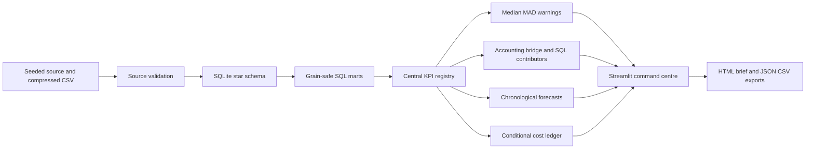
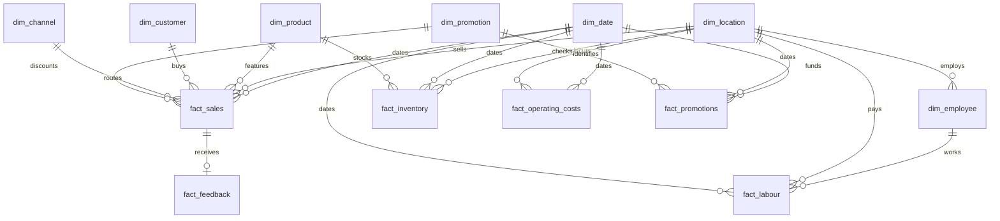
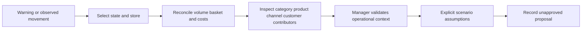
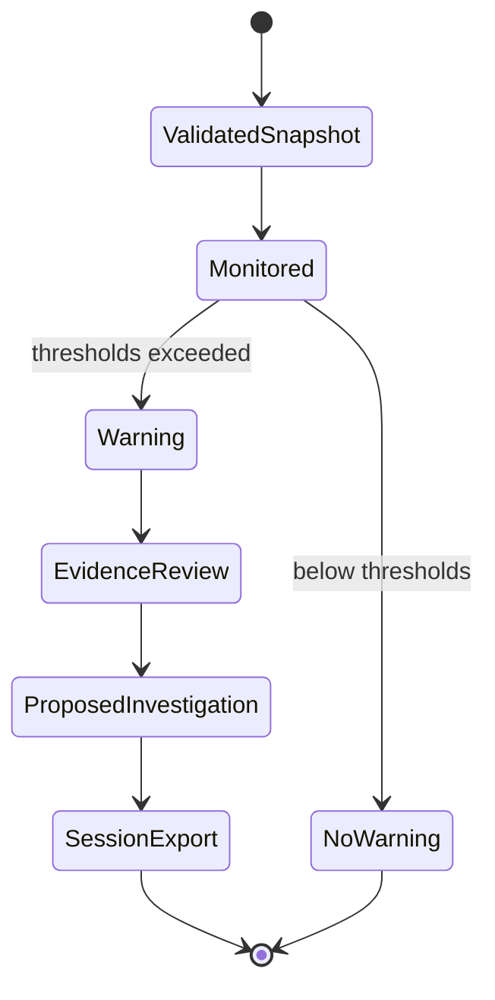

# Architecture and analytical methods

All records and stakeholder statements are synthetic. Source keys, grain and field definitions are in the [data dictionary](business-analysis/13-data-dictionary.md).

```mermaid
flowchart LR
    Statement[Raw stakeholder statement] --> Need[Business need]
    Need --> BR[Business requirement]
    BR --> FR[Functional requirement]
    FR --> Story[User story]
    Story --> AC[Acceptance criteria]
    AC --> Feature[Delivered feature]
    Feature --> Test[Automated verification]
    Test --> UAT[Simulated UAT evidence]
    UAT --> Outcome[Proposed business outcome]
```

**Database boundary:** `pulse/runtime.py` exposes read-only queries and bound parameters. Generator and validation publish a new constrained SQLite file only after data/FK/revenue checks. A PostgreSQL version would replace connection and parameter style, date functions, DDL and bulk load implementation; no drop-in portability claim. The current refresh must not run concurrently with a manager session; production needs versioned snapshots/connection lifecycle and job locks.

**Profit:** net sales excludes GST, discounts and refunds. Costs include products sold, loaded payroll, channel fees, overhead and campaigns. This is a simplified controllable operating ledger, not audited accounting profit. Fact tables aggregate before joining. The exact bridge separates list-sales volume using old list AOV, then basket using current volume; product mix/price/quantity cannot be uniquely identified within that residual.

**Warnings:** one-sided median/MAD with eight complete prior weeks, scale floor 3% of absolute baseline, z ≥2.5, adverse deviation ≥8%, monetary threshold A$150 and critical A$750. Negative-profit baselines use absolute denominators. Expected range is heuristic, not a probability interval. Multiple testing is unadjusted; sudden operational changes are easier to detect than slow drift. Ratio warnings need manager context; low refund/stockout baselines can create noisy warnings. Future production should add event calendars, minimum-rate floors and false-alert evaluation.

**Impact:** observed profit movement is a reconciled ledger change. Alert exposure is a reference gap, not avoided loss. Company exposure sums only operating-profit warning gaps once per store; different KPI gaps overlap. Stockout opportunity matches available store/SKU/weekdays with at least three observations, assumes 50% substitution by default and excludes unsupported reference cells. It cannot identify demand during an outage.

**Forecasting:** last-week repetition versus trailing eight-week weekday mean. Three expanding origins evaluate 28-day validation windows before a final untouched 28-day holdout. MAE selects the model; MAE/RMSE/MAPE and actual interval coverage are disclosed on the holdout. Daily approximate bands use per-horizon 90th percentile absolute errors from only three validation origins. No claim of calibrated 90% coverage or independent daily errors; summing bounds does not create a valid aggregate interval. Paid hours forecast historical labour, not optimal labour demand. Origin is 2025-12-31 in the full demo; forecast is January 2026 fictional continuation, not current 2026 business guidance.

**Customer/campaigns:** Customer/month activity, retention and cohort summaries are materialised and indexed during refresh, avoiding repeated million-order scans in the app. period distinct IDs exclude guest ID 0; repeat activity is within period; retention is next-month return and final month is censored. Cohorts are first observed, left-censored at source start. Campaign ROI compares whole store-day pre-labour contribution with non-campaign same-weekday reference in the preceding 56 days (at least three available reference days), then subtracts spend once; this captures store-level cannibalisation but remains confounded.

**Health/scenarios:** weights and targets are simulated stakeholder priorities, not learned risk coefficients. Each health score is a capped target ratio; negative operating margin scores zero. A scenario is a single-period cost ledger: price, basket quantity, transactions, payroll hours and wages are independent assumptions; no automatic elasticity or guaranteed benefit. The exact assumptions are in the app and engine.

Framework references used during implementation: [SQLite window functions](https://www.sqlite.org/windowfunctions.html), [Streamlit AppTest](https://docs.streamlit.io/develop/api-reference/app-testing/st.testing.v1.apptest). These references establish API mechanics; the local tests and reports establish PULSE results.
