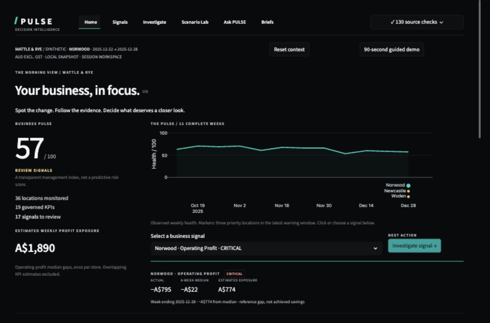

# Recruiter guide

## If you have 30 seconds

PULSE helps a fictional 36-store Australian business detect performance changes, investigate accounting contributors and challenge a proposed decision. It demonstrates Business Analysis supported by SQL/Python; all data and discovery are synthetic.

One computed example: the full demo detects a Norwood operating-profit warning. Review the [generated Monday brief](../reports/monday_brief.json) for actual/baseline/exposure and the [recommendations](business-analysis/21-executive-recommendations.md) for the proposed investigation. No real company outcome is claimed.

## If you have 2 minutes

Run the app and choose the 90-second guided demo, or follow Home → Signals → Norwood investigation → Scenario Lab → Briefs. Challenge the warning reference and accounting bridge, compare a conditional hours/demand scenario, then export an explicitly unapproved proposal. Ask PULSE is globally accessible. A reference gap or modelled improvement is not an achieved benefit. [Walkthrough](DEMO.md).

## If you have 5 minutes

Follow [business problem](business-analysis/01-business-problem.md) → [prioritised requirements](business-analysis/07-business-requirements.md) → [SQL](../sql/transform.sql) → [methods](ARCHITECTURE.md) → app investigation → [UAT](business-analysis/20-uat-results.md) → [recommendations](business-analysis/21-executive-recommendations.md).

## If you are a Business Analyst hiring manager

Inspect [discovery](business-analysis/04-discovery-notes.md), [workshop](business-analysis/26-discovery-workshop.md), [process maps](business-analysis/14-process-map.md), [traceability](business-analysis/16-traceability-matrix.md), [UAT plan](business-analysis/19-uat-plan.md), [change assessment](business-analysis/22-change-impact-assessment.md) and [proposed benefits](business-analysis/25-benefits-realisation.md).

## If you are technical

Inspect [architecture](ARCHITECTURE.md), [schema](../sql/schema.sql), [SQL contribution template](../sql/dimensional_contribution.sql), [engines](../pulse/), [tests](../tests/) and [actual audit](FINAL_AUDIT.md).

## If you care about commercial thinking

Inspect [impact estimates](../pulse/analytics/impact.py), [scenario assumptions](../pulse/scenarios/engine.py), [campaign comparison](../sql/promotion_analysis.sql), [recommendations](business-analysis/21-executive-recommendations.md) and [interview case](PORTFOLIO_CASE_STUDY.md). The evidence language deliberately separates accounting association from causation.
