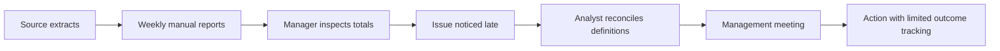
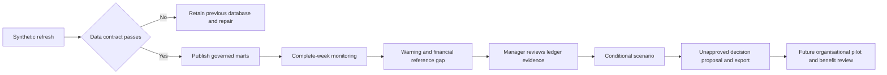

> Portfolio simulation: Wattle & Rye, stakeholders, statements and data are fictional. No real interviews, sign-offs or achieved benefits are claimed.

# Current and future process maps

Technology owns the refresh gate; Finance owns metric approval; Operations owns investigations. The final pilot box is a proposed organisational process, not an automated application action. [RACI](28-raci-matrix.md) assigns accountability; [implementation plan](23-implementation-plan.md) defines readiness gates.
