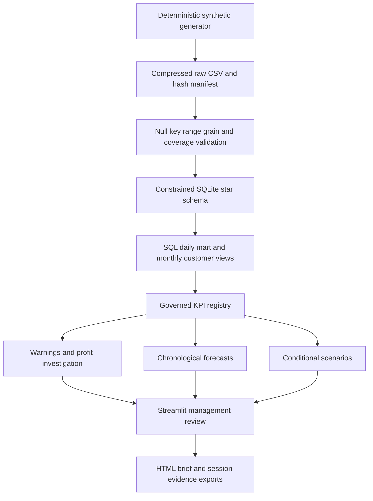

> Portfolio simulation: Wattle & Rye, stakeholders, statements and data are fictional. No real interviews, sign-offs or achieved benefits are claimed.

# Data flow and lineage

Sales lineages: source order → fact_sales → location/day aggregation → revenue and product cost → profit ledger. Payroll: employee/day → fact_labour → separate location/day aggregate → profit ledger. Stock: store/SKU/day → unavailable check count → stockout rate; opportunity uses same-SKU available-day observations. Feedback: response → order FK → location/day rating sums and counts → weighted mean. Retention bypasses additive mart customer counts and uses distinct customer/month activity.

[Data dictionary](13-data-dictionary.md) specifies grain and keys. A failed validation never replaces the previous DB. Forecast model selection excludes final holdout. User questions never become arbitrary SQL. Registry definition changes require Finance/Operations review under [governance](27-data-governance.md).
